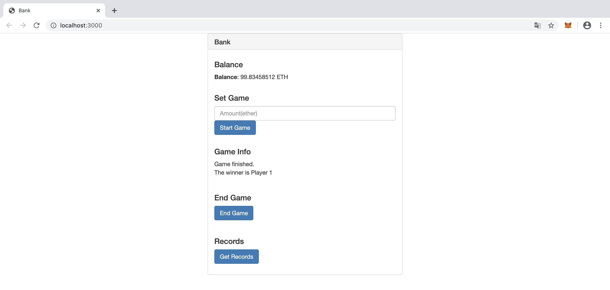

# Coin-Flipping

Coin-Flipping is a DApp for playing coin game online.


## Requirements

ganache 2.1.2

metamask 7.1.8

truffle 5.1.20

lite-server

## Usage

<b>Start Ganache</b>

<b>Check truffle.js</b>

<code>cd coin-flipping</code>

Set the port to you Ganache port.

```python
module.exports = {
  // See <http://truffleframework.com/docs/advanced/configuration>
  // for more about customizing your Truffle configuration!
  networks: {
    development: {
      host: "127.0.0.1",
      port: 7545,
      network_id: "*" // Match any network id
    }
  }
};
```

<b>Compile</b>

<code>truffle compile</code>

<b>Migrate</b>

<code>truffle compile</code>

<b>Start Server</b>

<code>lite-server</code>

You will see the interface of the bank.



By accessing the interface of the player, go to localhost:[port]/player.html


