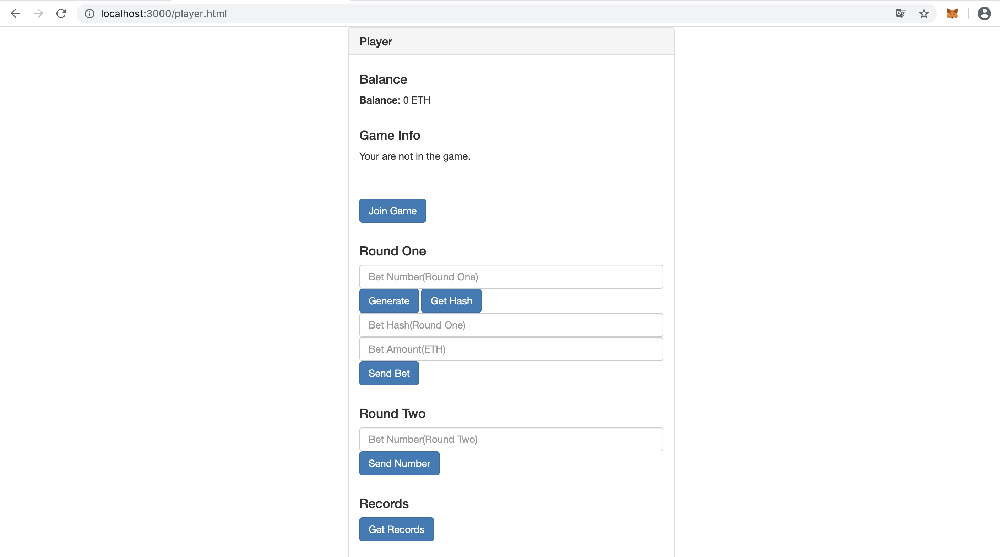

# Coin-Flipping

Coin-Flipping is a DApp for playing coin game online. 
This application allows two or more participants to play a coin-flipping game fairly and transfer funds to each other safely by using Ethereum.
In the first round, each participant need to send the amount and the hash value of the bet number to the contract. In the second round, each participant need to send their initial bet number to the contract.


## Requirements

ganache 2.1.2

metamask 7.1.8

truffle 5.1.20

lite-server

## Usage

<b>Start Ganache</b>

<b>Check truffle.js</b>

<code>cd coin-flipping</code>

Set the port to you Ganache port.

```python
module.exports = {
  // See <http://truffleframework.com/docs/advanced/configuration>
  // for more about customizing your Truffle configuration!
  networks: {
    development: {
      host: "127.0.0.1",
      port: 7545,
      network_id: "*" // Match any network id
    }
  }
};
```

<b>Compile</b>

<code>truffle compile</code>

<b>Migrate</b>

<code>truffle compile</code>

<b>Start Server</b>

<code>lite-server</code>

You will see the interface of the bank.


By accessing the interface of the player, go to localhost:[port]/player.html


